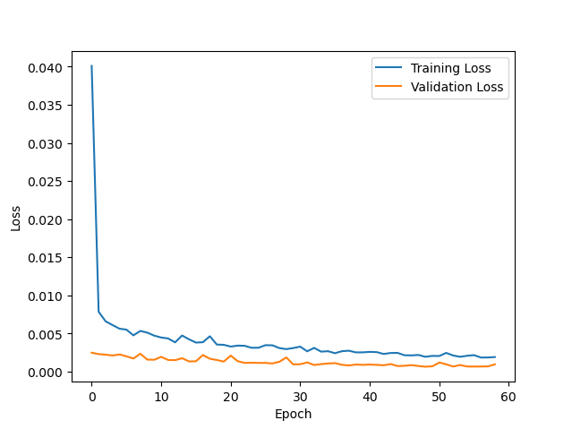
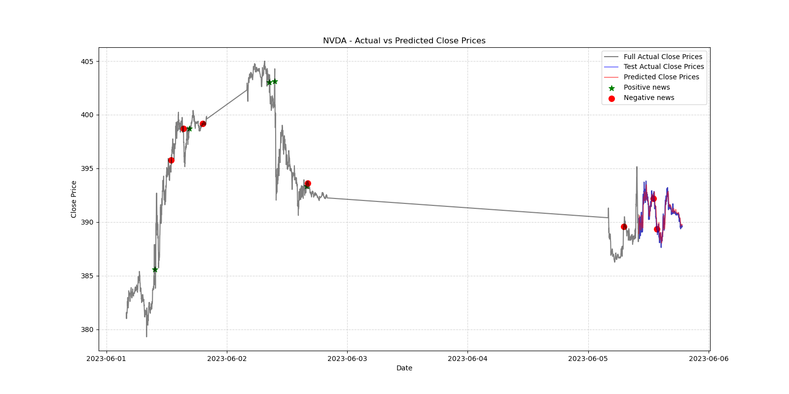

# IntelliStockAI
Neural Network to predict close prices using technical indicators and sentiment analysis

## Project Summary
This project involves the real-time collection and sentiment analysis of financial news related to specific stocks. It leverages web scraping techniques and the Alpaca Market News API to gather the latest financial news from Reuters and other sources. The news articles are then analyzed using the transformer-based FinBERT model to classify sentiment as positive, negative, or neutral. This project aims to provide an automated, effective way for traders and investors to stay informed about the latest market sentiment trends for specific stocks.

## stock_prediction_lstm.py summary
This Python script uses the Alpaca API to fetch historical stock data and then trains a Long Short-Term Memory (LSTM) network to predict future prices. The script also uses sentiment analysis data from the fetch_news_sentiment_analysis.py script and combines it with the historical data before feeding it to the LSTM.

The LSTM model is a type of Recurrent Neural Network (RNN) used for time series data such as stock prices. This is due to their ability to remember important aspects of the input data, which can be beneficial when considering the temporal sequence of stock prices. Here are the main steps performed in the script:

1. Environment setup: Importing required modules and functions, and defining some utility functions like load_api_keys (for loading API keys from environment variables) and parse_arguments (for parsing command-line arguments).

2. Data acquisition: Using Alpaca API keys to fetch historical stock data for a given symbol (stock ticker).

3. Data preparation: Calculating technical indicators from the fetched historical data and normalizing these features.

4. Sentiment data: Fetching sentiment data related to the stock from a function fetch_news located in fetch_news_sentiment_analysis.py and merging it with the historical data.

5. Feature selection: Using an iterative feature selection method defined in feature_selection.py to determine the optimal features.

6. Data reshaping: Converting the data into sequences suitable for LSTM and splitting the dataset into training and testing sets.

7. Model building and training: Building an LSTM model defined in model.py and training it using the prepared data.

8. Model evaluation: Evaluating the trained model on the test set and visualizing the training and validation loss.

9. Prediction and performance metrics: Making predictions with the trained model and calculating performance metrics like Mean Squared Error (MSE), Mean Absolute Error (MAE), and R^2 Score.

10. Visualization: Plotting the actual vs predicted close prices, and marking the occurrence of positive and negative news.

11. OHLC plotting: If the data fetched is daily, it calls a function plot_ohlc_data from plotting.py to create an OHLC (Open, High, Low, Close) chart.

The script is an example of how machine learning and sentiment analysis can be combined to make predictions on financial data. However, it is essential to note that this is a simplistic model and may not account for all the factors influencing the stock price. It should be used for educational purposes and not for making actual investment decisions.

## fetch_news_sentiment_analysis.py summary
The fetch_news_sentiment_analysis.py script has a primary goal of fetching news about a specific stock symbol from the Alpaca market news API, conducting sentiment analysis on the news articles, and printing the sentiment scores. It uses the FinBERT model, a transformer-based model specifically trained for financial sentiment analysis, to assess the sentiment of the news.

Here's a brief overview of the script:

1. Imports: The script imports several packages for different purposes, including argparse for command-line argument parsing, pandas for data manipulation, and transformers for using the FinBERT model.

2. Sentiment Analysis Preparation: It uses the AutoTokenizer and AutoModelForSequenceClassification classes from the transformers package to load the pretrained FinBERT model and its corresponding tokenizer.

3. Helper Functions: The script contains various helper functions to perform tasks such as removing HTML tags from text (remove_html_tags), preparing text for sentiment analysis (prepare_for_sentiment_analysis), getting a trading date (get_trading_date_before_days), computing sentiment score (compute_sentiment_score), and converting to Eastern Standard Time (convert_to_est).

4. Fetching News and Sentiment Analysis: The main function fetch_news does the heavy lifting. It sends a GET request to the Alpaca API to fetch the news related to the specified stock symbol. For each news article, it prepares the text for sentiment analysis, computes the sentiment scores, and stores these along with the symbol, headline, and timestamp in a pandas DataFrame. It uses aiohttp and asyncio to handle asynchronous HTTP requests, allowing the script to fetch multiple pages of news concurrently.

5. Main Execution: In the main execution block, the script uses argparse to accept command-line arguments for the stock symbol and the number of trading days before today for which to fetch news. It reads API keys from the environment variables and calls the fetch_news function with these arguments.

The function fetch_news is asynchronous, so it's run using asyncio.run().

The script is meant to be run from the command line and requires certain environment variables (APCA_API_KEY_ID and APCA_API_SECRET_KEY) to be set. The user must pass the stock symbol as a command-line argument and can optionally specify the number of trading days.

Please note that this script fetches only the top 50 articles at a time. If there are more articles, it fetches them page by page until no more articles are left.

The sentiment scores represent probabilities for positive, negative, and neutral sentiment. They sum up to 1, as the script uses softmax to compute these scores.

## System Requirements

- Ubuntu 22.04
- CUDA and cuDNN compatible GPU

## Installation

Follow the steps below to set up your environment:

1. **Install CUDA and cuDNN:** 

   On Ubuntu, you can install CUDA and cuDNN via the `apt-get` package manager. Use the following commands:

   ```bash
   sudo apt-get update
   sudo apt-get install -y nvidia-cuda nvidia-cudnn

   You may need to adjust the package names depending on the available versions.

2. **Find Compatible TensorFlow Version:**

   Depending on the CUDA version installed, you may need a specific version of TensorFlow. Consult the TensorFlow website for compatibility information.

3. Install Python Packages:

   Install the remaining Python packages using pip with the provided requirements.txt file:

   ```
   pip install -r requirements.txt
   ```

4. **Set Environment Variable:**

   To reduce TensorFlow execution warnings, add the following line to your .bashrc file:

   ```
   export TF_CPP_MIN_LOG_LEVEL=3
   ```

   Then, apply the changes with:

   ```
   source ~/.bashrc
   ```

## Usage
After installing, you can run the script gpu.py to test the installation and perform a quick training example:

```
python gpu.py

The output should look something like this:

TensorFlow Version:  2.10.1
GPU devices:  [PhysicalDevice(name='/physical_device:GPU:0', device_type='GPU')]
Is built with CUDA:  True
CUDA Version:  11.2
CuDNN Version:  8
Epoch 1/5
1875/1875 [==============================] - 3s 1ms/step - loss: 0.2852 - accuracy: 0.9140
Epoch 2/5
1875/1875 [==============================] - 3s 1ms/step - loss: 0.1347 - accuracy: 0.9595
Epoch 3/5
1875/1875 [==============================] - 3s 1ms/step - loss: 0.1033 - accuracy: 0.9678
Epoch 4/5
1875/1875 [==============================] - 3s 1ms/step - loss: 0.0880 - accuracy: 0.9724
Epoch 5/5
1875/1875 [==============================] - 2s 1ms/step - loss: 0.0764 - accuracy: 0.9757
313/313 - 0s - loss: 0.0829 - accuracy: 0.9748 - 415ms/epoch - 1ms/step

Test accuracy: 0.9747999906539917

If this works, then try executing the prediction network.

Example:  python stock_prediction_lstm.py -s nvda -n 3

The output should look like the following:

.... partial output listing ...

Epoch 54/100
48/48 [==============================] - 1s 15ms/step - loss: 0.0019 - val_loss: 8.5527e-04
Epoch 55/100
48/48 [==============================] - 1s 18ms/step - loss: 0.0021 - val_loss: 6.6583e-04
Epoch 56/100
48/48 [==============================] - 1s 13ms/step - loss: 0.0022 - val_loss: 6.5350e-04
Epoch 57/100
48/48 [==============================] - 1s 16ms/step - loss: 0.0018 - val_loss: 6.5928e-04
Epoch 58/100
48/48 [==============================] - 1s 15ms/step - loss: 0.0018 - val_loss: 6.7482e-04
Epoch 59/100
48/48 [==============================] - 1s 17ms/step - loss: 0.0019 - val_loss: 9.4379e-04
15/15 [==============================] - 0s 4ms/step - loss: 5.0672e-04
Test loss: 0.0005067238816991448
15/15 [==============================] - 1s 4ms/step
Mean Squared Error: 0.33
Mean Absolute Error: 0.42
R^2 Score: 0.82
                             Actual   Predicted
t                                              
2023-06-05 10:06:00-04:00  390.2900  388.925232
2023-06-05 10:07:00-04:00  390.3299  389.134766
2023-06-05 10:08:00-04:00  390.3100  389.423462
2023-06-05 10:09:00-04:00  389.9999  389.745880
2023-06-05 10:10:00-04:00  390.3338  390.037842
...                             ...         ...
2023-06-05 18:40:00-04:00  389.5300  389.781494
2023-06-05 18:41:00-04:00  389.6500  389.770752
2023-06-05 18:42:00-04:00  389.6500  389.761902
2023-06-05 18:44:00-04:00  389.6500  389.756195
2023-06-05 18:46:00-04:00  389.6100  389.751587

```



## License

This project is licensed under the Apache License 2.0.
